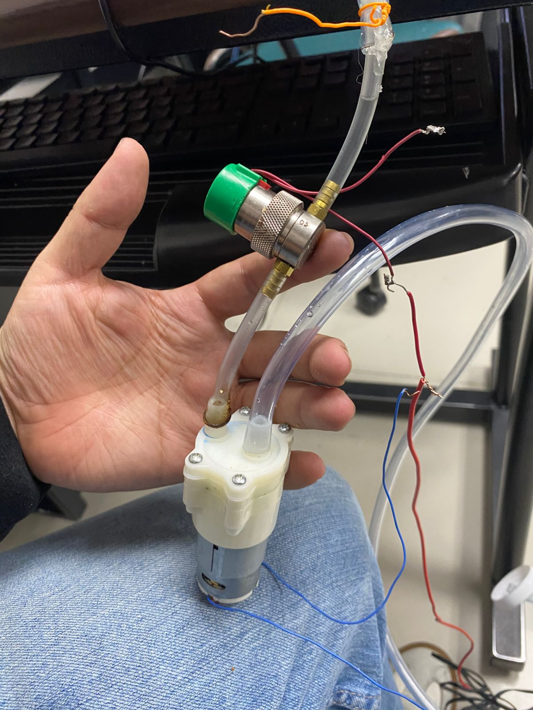
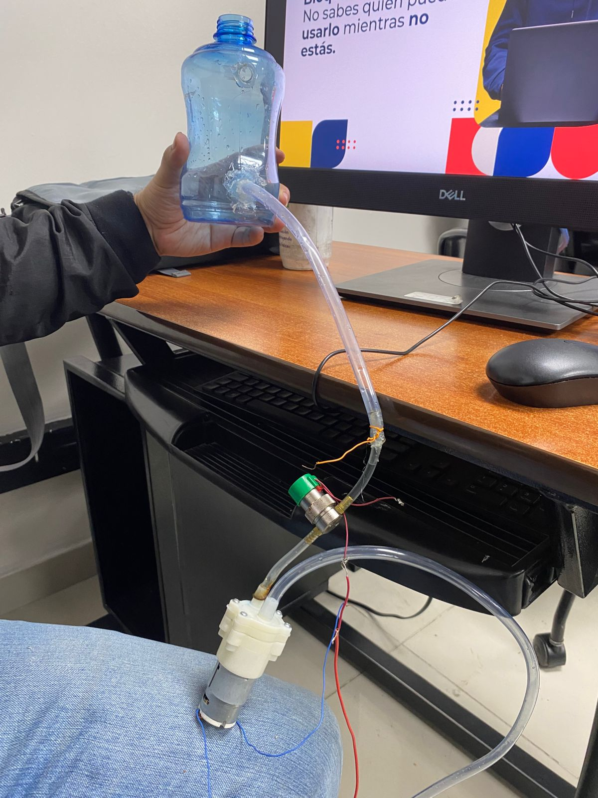

# Proyecto integrador 1ra Entrega

## Integrantes
Carlos Medina
Steven Herrera
Daniel Camacho

## Arquitectura propuesta

https://www.canva.com/design/DAG1cVy12yg/E4Qc-J4MVz6ouh9iPDee0Q/edit?utm_content=DAG1cVy12yg&utm_campaign=designshare&utm_medium=link2&utm_source=sharebutton

## Periférico a trabajar

Bomba y electrovalvula

## Avances

Se realizaron pruebas con la electrovalvula en la cual se evidencio que el flujo presentado es muy bajo, por lo cual se decide probar con una bomba de paso, en esta se presenta un estancamiento de fluido en la salida de la bomba, lo que genera una perdida de pintura en las medidas solicitadas. Por lo cual se plantea el uso de una electrovalvula de mayor paso para poder tener una mayor cantidad de pintura, sumado a esto se pondrá la bomba luego de la electrovalvula, de esta manera se genera un mayor flujo, con la electrovalvula se tendria controlada la cantidad de pintura extraida, luego del cierre de la misma se mantiene activa la bomba por un tiempo a estimar, lo cual permitirá la inyección de la pintura extraida del tanque y se mantiene los conductos libres de pintura residual.

Documentación:

# ------------------------------------------------------------
# Proyecto: Control de Bombas mediante MQTT con ESP32
# Descripción:
# Este programa conecta un ESP32 a una red WiFi y a un broker MQTT
# para controlar 5 bombas mediante comandos enviados al tópico:
# "bombas/control".
#
# ------------------------------------------------------------

# --- Importación de librerías necesarias ---
import network          # Para manejar la conexión WiFi
import time             # Para funciones de tiempo (pausas, esperas)
from machine import Pin # Para controlar los pines GPIO del ESP32
from umqtt.robust import MQTTClient  # Para comunicación con el broker MQTT
import ujson            # Para manejar datos en formato JSON (no se usa aquí)

# --- Configuración del WiFi y MQTT ---
import wify             # Archivo local con la función wify.conectar()
BROKER = "6.tcp.ngrok.io"   # Dirección del broker MQTT (vía ngrok o Raspberry Pi)
PORT = 18263                # Puerto del broker MQTT
TOPIC = b"bombas/control"   # Tópico MQTT (debe ir como bytes)

# --- Conexión WiFi ---
# Se intenta establecer conexión con el WiFi usando la función conectar() del módulo wify.
# Si no se logra la conexión, el programa queda detenido en un bucle infinito.
if not wify.conectar():
    print("Error: no se puede continuar sin conexión WiFi")
    while True:
        time.sleep(1)

# --- Configuración de los pines que controlan las bombas ---
# Cada bomba está conectada a un pin GPIO configurado como salida digital.
bombas = [
    Pin(14, Pin.OUT),  # Bomba 1
    Pin(12, Pin.OUT),  # Bomba 2
    Pin(13, Pin.OUT),  # Bomba 3
    Pin(27, Pin.OUT),  # Bomba 4
    Pin(26, Pin.OUT)   # Bomba 5
]

# --- Función callback MQTT ---
# Esta función se ejecuta automáticamente cada vez que llega un mensaje MQTT.
def mensaje(topic, msg):
    msg = msg.decode()  # Convierte el mensaje de bytes a texto
    print(f"Mensaje recibido en {topic}: {msg}")

    # Comparación del mensaje recibido para determinar qué bomba controlar
    if msg == "B1_ON":
        bombas[0].value(1)  # Enciende bomba 1
    elif msg == "B1_OFF":
        bombas[0].value(0)  # Apaga bomba 1
    elif msg == "B2_ON":
        bombas[1].value(1)  # Enciende bomba 2
    elif msg == "B2_OFF":
        bombas[1].value(0)  # Apaga bomba 2
    elif msg == "B3_ON":
        bombas[2].value(1)  # Enciende bomba 3
    elif msg == "B3_OFF":
        bombas[2].value(0)  # Apaga bomba 3
    elif msg == "B4_ON":
        bombas[3].value(1)  # Enciende bomba 4
    elif msg == "B4_OFF":
        bombas[3].value(0)  # Apaga bomba 4
    elif msg == "B5_ON":
        bombas[4].value(1)  # Enciende bomba 5
    elif msg == "B5_OFF":
        bombas[4].value(0)  # Apaga bomba 5
    else:
        print("⚠️ Comando desconocido:", msg)

# --- Función para conectarse al broker MQTT ---
def conectar_mqtt():
    # Crea el cliente MQTT con nombre de dispositivo, dirección y puerto del broker
    client = MQTTClient("ESP32_Bombas", BROKER, PORT)
    # Asocia la función callback para procesar mensajes entrantes
    client.set_callback(mensaje)
    # Conecta al broker MQTT
    client.connect()
    # Se suscribe al tópico donde recibirá comandos
    client.subscribe(TOPIC)
    print("✅ Conectado al broker MQTT y suscrito a 'bombas/control'")
    return client  # Devuelve el objeto cliente para usarlo en el programa principal

# --- Programa principal ---
# Conecta al broker e inicia el bucle de recepción de mensajes
cliente = conectar_mqtt()

try:
    while True:
        cliente.check_msg()  # Revisa constantemente si hay nuevos mensajes MQTT
        time.sleep(0.1)      # Espera breve para no sobrecargar el microcontrolador
except KeyboardInterrupt:
    # Si el usuario interrumpe la ejecución (Ctrl + C), se desconecta del broker
    print("Desconectando del broker MQTT...")
    cliente.disconnect()

